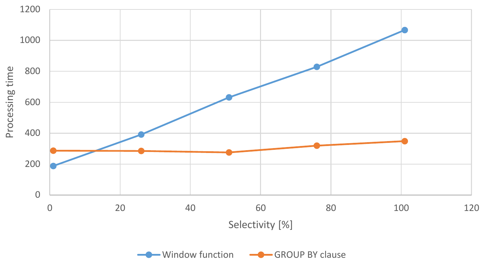

# Greatest per group - Window functions vs. aggregation

DBMS: PostgreSql 9.6.1

Let us have a sample table with customers where each customer belongs to one country (countryId attribute). Each customer has one payment attribute randomly selected from (0,10000) interval. The following command load 1M customers into a PostgreSQL database.

```sql
CREATE TABLE customer AS
SELECT id, 
   'Customer Name ' || id as name, 
   id % 1000 countryId, 
   cast(random() * 10000 as int) payment
FROM generate_series(0, 1000000) id;
```

Now consider a task where we would like to find customers having minimal payment value in their country. In order to reduce the results lets do the sum of their IDs. Let us start with a window function solution:

```sql
SELECT sum(id)
FROM (
	SELECT *,
		DENSE_RANK() OVER (PARTITION BY countryId ORDER BY payment) rank
	FROM customer
	WHERE countryId < 500
) ranking
WHERE rank = 1;
```

This SQL syntax leads the PostgreSQL into a query plan where he scans the customer table sequentially filter out the customers having `countryId >= 500 or NULL`, then it performs sort, window function computation and finaly it sums the customer IDs. This query plan take almost a second on my PostgreSQL as can be observed from the following query plan.

```
Aggregate  (cost=84317.82..84317.83 rows=1 width=8) (actual time=864.136..864.136 rows=1 loops=1)
  ->  Subquery Scan on ranking  (cost=68062.39..84311.57 rows=2500 width=4) (actual time=557.304..864.097 rows=520 loops=1)
        Filter: (ranking.rank = 1)
        Rows Removed by Filter: 499481
        ->  WindowAgg  (cost=68062.39..78061.89 rows=499975 width=52) (actual time=557.303..844.944 rows=500001 loops=1)
              ->  Sort  (cost=68062.39..69312.32 rows=499975 width=12) (actual time=557.275..570.990 rows=500001 loops=1)
                    Sort Key: customer.countryid, customer.payment
                    Sort Method: quicksort  Memory: 35726kB
                    ->  Seq Scan on customer  (cost=0.00..20736.01 rows=499975 width=12) (actual time=0.026..210.510 rows=500001 loops=1)
                          Filter: (countryid < 500)
                          Rows Removed by Filter: 500000
Planning Time: 1.129 ms
Execution Time: 870.723 ms
```

As we can observe from the EXPLAIN PLAN the major work is attributed to the customer table sort (we are sorting 500k rows) and window function computation. Let us test another solution using a `GROUP BY` clause.

```sql
SELECT sum(c.id)
FROM customer c
JOIN (
	SELECT countryId, MIN(payment) min_payment
	FROM customer
	WHERE countryId < 500
	GROUP BY countryId
) ranking ON c.countryId = ranking.countryId AND
   c.payment = ranking.min_payment;
```

We obtain a fundamentally different query plan using hash aggregate to compute `min(payment)` per `countryId` using a sequential scan. The aggregated result for each table is then joined with country table using a hash join. This query plan is almost two times faster then the previous solution on my server (500ms vs 870ms).

```
Aggregate  (cost=46757.15..46757.16 rows=1 width=8) (actual time=496.895..496.896 rows=1 loops=1)
  ->  Hash Join  (cost=23270.89..46756.90 rows=100 width=4) (actual time=292.493..496.846 rows=520 loops=1)
        Hash Cond: ((c.countryid = customer.countryid) AND (c.payment = (min(customer.payment))))
        ->  Seq Scan on customer c  (cost=0.00..18236.01 rows=1000001 width=12) (actual time=0.025..80.995 rows=1000001 loops=1)
        ->  Hash  (cost=23255.89..23255.89 rows=1000 width=8) (actual time=292.374..292.374 rows=500 loops=1)
              Buckets: 1024  Batches: 1  Memory Usage: 28kB
              ->  HashAggregate  (cost=23235.89..23245.89 rows=1000 width=8) (actual time=292.173..292.280 rows=500 loops=1)
                    Group Key: customer.countryid
                    ->  Seq Scan on customer  (cost=0.00..20736.01 rows=499975 width=8) (actual time=0.013..166.279 rows=500001 loops=1)
                          Filter: (countryid < 500)
                          Rows Removed by Filter: 500000
Planning Time: 0.962 ms
Execution Time: 497.054 ms
```

## Adjusting the filter condition and indexes

The problem of window function solution is obviously the sort of the large intermediate result. If we change the selectivity of the `WHERE` clause we might get a slightly different statistics. The following picture shows how the processing time changes with changes of the query selectivity. 




The solution using the hash aggregation and hash join is clearly more robust when compared to the sort used by window function which is not very surprising. The difference between these solutions can be even more significant if we create anpropriate covering index for the queries.

```sql
CREATE INDEX ix_customer_countryid ON customer(countryId, payment, id);
```
If we process the above queries having this index the processing time is 720 ms vs. 325 ms. Having this index, the window function query avoids expensive sort , however, assigment of ranks and subsequent filtering using sequential scan is still quite expensive operation.


