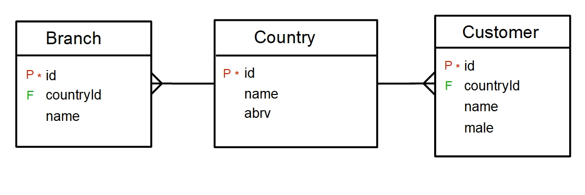

# Query efficiency dependent on SQL syntax in PostgreSQL

This article shows an example where the SQL syntax can make a difference in the query processing time. The example is prepared for PostgreSql 9.6.1, however, the main aim is to speak generally about the SQL declarativeness.

Let us have a sample database with customers and company branches where each customer or branch belongs to one country. 



Let's load some sample data into the repository using INSERT INTO. The following command load 100 countries, 1M customers and 10k branches into a PostgreSQL database.

```sql
INSERT
INTO    country
SELECT
   id,
   'Country ' || id as name,
   'Ab'
FROM generate_series(0, 95) id
UNION
SELECT 96, 'Czech republic', 'Cz'
UNION
SELECT 97, 'Slovakia', 'Sk'
UNION
SELECT 98, 'Poland', 'Pl'
UNION
SELECT 99, 'Hungary', 'Hu'
UNION
SELECT 100, 'Croatia', 'Hr';

INSERT
INTO    customer
SELECT id, 'Customer ' || id as name, id % 2 male, id % 101 countryId
FROM generate_series(0, 1000000) id;

INSERT
INTO    branch
SELECT id, id % 101 countryId,  'Branch ' || id as name
FROM generate_series(0, 1000) id;
```
Now consider a task where we would like to find a count of customers and a count of branches for some countries. One straightforward solution is to use subqueries.

```sql
SELECT co.id, co.name,
    (
      SELECT count(*)
      FROM Customer cu
      WHERE cu.countryId = co.id
    ) cust_cnt,
    (
      SELECT count(*)
      FROM Branch br
      WHERE br.countryId = co.id
    ) branch_cnt
FROM Country co
WHERE co.abrv IN ('Cz', 'Sk', 'Pl', 'Hu', 'Hr');
```

This SQL syntax leads the PostgreSQL into a query plan where he scans the country table sequentially and for each country matching the condition, he performs a sequential scan on customer and branch table (see the query plan below). Therefore, even though it is not stated explicitly in the query plan, he uses the unindexed nested loop join. The major disadvantage of this approach is that he may repeat the scan many times and this solution can give a hard time to your database system for a more significant number of countries.  

```
Seq Scan on country co  (cost=0.00..99489.25 rows=5 width=30) (actual time=128.078..643.358 rows=5 loops=1)
  Filter: (abrv = ANY ('{Cz,Sk,Pl,Hu,Hr}'::bpchar[]))
  Rows Removed by Filter: 96
  SubPlan 1
    ->  Aggregate  (cost=19877.76..19877.77 rows=1 width=8) (actual time=128.497..128.498 rows=1 loops=5)
          ->  Seq Scan on customer cu  (cost=0.00..19853.01 rows=9901 width=0) (actual time=0.017..127.798 rows=9901 loops=5)
                Filter: (countryid = co.id)
                Rows Removed by Filter: 990100
  SubPlan 2
    ->  Aggregate  (cost=19.54..19.55 rows=1 width=8) (actual time=0.147..0.147 rows=1 loops=5)
          ->  Seq Scan on branch br  (cost=0.00..19.51 rows=10 width=0) (actual time=0.023..0.125 rows=9 loops=5)
                Filter: (countryid = co.id)
                Rows Removed by Filter: 992
Planning time: 0.215 ms
Execution time: 643.425 ms
```

As we can observe from the EXPLAIN PLAN the major work is attributed to the customer table scan due to its size. Let us test another solution using an independent aggregation.

```sql
SELECT co.id, co.name, t1.cust_cnt, t2.branch_cnt
FROM Country co
LEFT JOIN (
   SELECT countryId,
        count(1) cust_cnt
   FROM Customer
   GROUP BY countryId
) t1 ON co.id = t1.countryId
LEFT JOIN (
   SELECT countryId,
        count(1) branch_cnt
   FROM Branch
   GROUP BY countryId
) t2 ON co.id = t2.countryId
WHERE co.abrv IN ('Cz', 'Sk', 'Pl', 'Hu', 'Hr');
```

We obtain a fundamentally different query plan using hash aggregate to compute count per countryId using just one sequential scan. The aggregated result for each table is then joined with country table using a hash join. This query plan is two times faster then the previous solution on my server (300ms vs 600ms), but the most important thing is that its complexity is constant with the number of countries.

```
Hash Right Join  (cost=22380.24..22382.69 rows=5 width=30) (actual time=307.262..307.287 rows=5 loops=1)
  Hash Cond: (customer.countryid = co.id)
  ->  HashAggregate  (cost=22353.01..22354.02 rows=101 width=12) (actual time=306.756..306.772 rows=101 loops=1)
        Group Key: customer.countryid
        ->  Seq Scan on customer  (cost=0.00..17353.01 rows=1000001 width=4) (actual time=0.014..79.555 rows=1000001 loops=1)
  ->  Hash  (cost=27.17..27.17 rows=5 width=22) (actual time=0.453..0.453 rows=5 loops=1)
        Buckets: 1024  Batches: 1  Memory Usage: 9kB
        ->  Hash Right Join  (cost=24.72..27.17 rows=5 width=22) (actual time=0.412..0.433 rows=5 loops=1)
              Hash Cond: (branch.countryid = co.id)
              ->  HashAggregate  (cost=22.02..23.03 rows=101 width=12) (actual time=0.322..0.329 rows=101 loops=1)
                    Group Key: branch.countryid
                    ->  Seq Scan on branch  (cost=0.00..17.01 rows=1001 width=4) (actual time=0.012..0.092 rows=1001 loops=1)
              ->  Hash  (cost=2.64..2.64 rows=5 width=14) (actual time=0.074..0.074 rows=5 loops=1)
                    Buckets: 1024  Batches: 1  Memory Usage: 9kB
                    ->  Seq Scan on country co  (cost=0.00..2.64 rows=5 width=14) (actual time=0.037..0.063 rows=5 loops=1)
                          Filter: (abrv = ANY ('{Cz,Sk,Pl,Hu,Hr}'::bpchar[]))
                          Rows Removed by Filter: 96
Planning time: 0.405 ms
Execution time: 307.474 ms
```

So far so good. So we have an ideal syntax for this query problem, right? Let's have a look at what happens if we create an index on the customer.countryId attribute and branch.countryId attribute. Indexes on the foreign key are recommended to be there anyway.

```sql
CREATE INDEX ix_customer_countryid
    on customer(countryId);

CREATE INDEX ix_branch_countryid
    on branch(countryId);
```

Now we have an entirely different picture. The PostgreSQL uses an indexed nested loop join in the case of the first query whereas the second query plan remains unchanged. Indexes nested loop join now outperforms the hash aggregation even for a larger number of countries. On my server, the first query runs six times faster (55ms vs 300ms). We still have linear complexity of the first query, however, for a low number of countries we get better query time. How much low precisely? In my data, the tipping point is somewhere around 25 countries.

Let's summarize the observation from this example. To select appropriate SQL syntax for our problem we should at least know:

1. the physical design of the database,
2. the selectivity of the important predicates.

Ok, when I'm starting the SQL lecture at our university I always say that SQL is the most popular declarative language (I want the subject to look important). I emphasize the word declarative. However, the reality is completely different. We may observe a situation like in our example in hundreds of everyday SQL queries. The database systems expect us to have deep knowledge about the query processing internals to achieve a good query plans which is not very declarative.

I know that the query optimization is a hard problem and the database systems may improve their abilities in time (and some other database systems really interpret the above example much better) but the point of this article is to show that the current situation is not very satisfactory even for simple situation and simple data like in our example. It is possible to find simple examples like this in every database system. If we consider the fact that the database systems are often used by people who lack deep knowledge about the database systems, or worse SQL queries are even generated by some ORM framework then we realize that improving the query optimizer abilities is still an important problem in a nowadays database systems.

